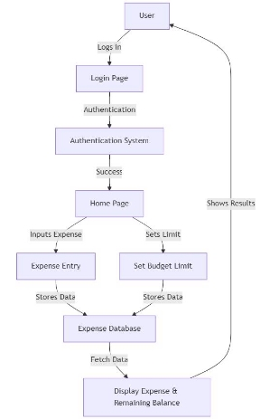
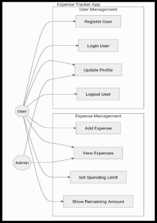
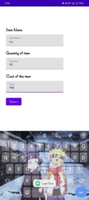
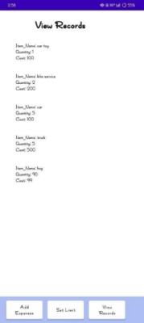
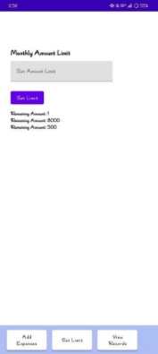
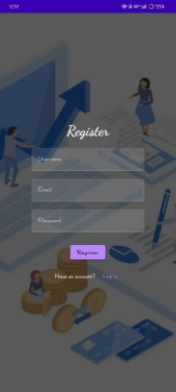
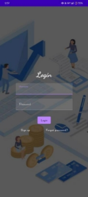

**Money Matters: A Personal Finance ![ref1]Management App** 

1. **Abstract:** 

   A Personal  Finance  Management  App is  a lightweight  and intuitive  mobile  app designed to help users manage their finances efficiently. Developed in Kotlin, the app features a simple and user-friendly interface. It allows users to: 

- Login: Securely access their accounts through a basic login screen. 
- Set Spending Limits: Define a monthly or weekly spending cap to maintain financial discipline.   
- Track Expenses: Input daily expenses, which are recorded and displayed in real time.   
- Monitor Finances: View total expenses and the remaining balance, enabling users to stay within their budget. 

This  straightforward implementation focuses on core functionalities, making it ideal for users seeking a hassle-free expense management solution. 

2. **Introduction:** 

   In an era where financial stability and planning are more crucial than ever, managing personal  finances  effectively  can  be  a  daunting  task  for  many.  Enter  Money  Matters,  a revolutionary  personal  finance  management  app  designed to  simplify  and enhance  the  way individuals handle their financial affairs. This app provides a comprehensive suite of tools that empower users to track their expenses, manage budgets, set financial goals, and make informed 

   financial decisions. 

   Money  Matters  aims  to  bridge  the  gap  between  financial  literacy  and  practical  money management. With its user-friendly interface and robust features, the app caters to both beginners and seasoned financial planners. Users can easily monitor their spending patterns, analyze their financial health, and receive personalized insights to help them achieve their financial goals. 

   The app integrates seamlessly with various financial institutions, allowing users to sync their bank accounts, credit cards, and investments in one place. This centralization of financial data not only saves time but also provides a holistic view of one’s financial status. Additionally, Money Matters offers secure data encryption to ensure the privacy and safety of user information. 

   As the landscape of personal finance continues to evolve, Money Matters stands out as a vital tool for anyone looking to take control of their financial future. By providing actionable insights and fostering better financial habits, Money Matters is not just an app but a partner in financial well- being. 

3. **Data flow diagram: ![ref1]**
3. **Use case diagram:  **

5. **Software Requirement:  ![ref1]**
   1. Programming Language: Kotlin - for developing the app.   
   1. IDE (Integrated Development Environment): Android Studio - for coding, designing, and testing the app.   
   1. Database: SQLite or Room - to store user data like expenses and budget limits.  
   1. Operating System: Android (minimum version 5.0 Lollipop or higher) - for app compatibility.   
   1. Authentication: Firebase Authentication (optional) - to manage user login securely.   
6. **Sample Program Code :**  

package com.example.expensestracker 

import android.annotation.SuppressLint 

import android.content.Intent 

import android.os.Bundle 

import androidx.activity.ComponentActivity 

import androidx.activity.compose.setContent 

import androidx.compose.foundation.Image 

import androidx.compose.foundation.layout.\* import androidx.compose.material.\* 

import androidx.compose.runtime.\* 

import androidx.compose.ui.Alignment 

import androidx.compose.ui.Modifier 

import androidx.compose.ui.graphics.Color 

import androidx.compose.ui.res.painterResource import androidx.compose.ui.text.font.FontWeight import androidx.compose.ui.text.style.TextAlign import androidx.compose.ui.tooling.preview.Preview import androidx.compose.ui.unit.dp 

import androidx.compose.ui.unit.sp 

import com.example.expensestracker.ui.theme.ExpensesTrackerTheme 

class MainActivity : ComponentActivity() { 

`    `@SuppressLint("UnusedMaterialScaffoldPaddingParameter") 

`    `override fun onCreate(savedInstanceState: Bundle?) { 

`        `super.onCreate(savedInstanceState) 

`        `setContent { 

`            `Scaffold( 

`                `// in scaffold we are specifying top bar. 

`                `bottomBar = { 

`                    `// inside top bar we are specifying 

`                    `// background color. 

`                    `BottomAppBar(backgroundColor = Color(0xFFadbef4),                         modifier = Modifier.height(80.dp), 

`                        `// along with that we are specifying 

`                        `// title for our top bar. 

`                        `content = { 

Spacer(modifier = Modifier.width(15.dp)) ![ref1]

`                            `Button( 

`                                `onClick = {startActivity(Intent(applicationContext,AddExpensesActivity::class.java))}, 

`                                `colors = ButtonDefaults.buttonColors(backgroundColor = Color.White),                                 modifier = Modifier.size(height = 55.dp, width = 110.dp) 

`                            `) 

`                            `{ 

`                                `Text( 

`                                    `text = "Add Expenses", color = Color.Black, fontSize = 14.sp, 

`                                    `textAlign = TextAlign.Center 

`                                `) 

`                            `} 

Spacer(modifier = Modifier.width(15.dp)) 

`                            `Button( 

`                                `onClick = { 

`                                    `startActivity( 

`                                        `Intent( 

`                                            `applicationContext, 

`                                            `SetLimitActivity::class.java 

`                                        `) 

`                                    `) 

`                                `}, 

`                                `colors = ButtonDefaults.buttonColors(backgroundColor = Color.White),                                 modifier = Modifier.size(height = 55.dp, width = 110.dp) 

`                            `) 

`                            `{ 

`                                `Text( 

`                                    `text = "Set Limit", color = Color.Black, fontSize = 14.sp, 

`                                    `textAlign = TextAlign.Center 

`                                `) 

`                            `} 

Spacer(modifier = Modifier.width(15.dp)) 

`                            `Button( 

`                                `onClick = { 

`                                    `startActivity( 

`                                        `Intent( 

`                                            `applicationContext, 

`                                            `ViewRecordsActivity::class.java 

`                                        `) 

`                                    `) 

`                                `}, 

`                                `colors = ButtonDefaults.buttonColors(backgroundColor = Color.White),                                 modifier = Modifier.size(height = 55.dp, width = 110.dp) 

`                            `) 

`                            `{ 

`                                `Text( 

`                                    `text = "View Records", color = Color.Black, fontSize = 14.sp, ![ref1]                                    textAlign = TextAlign.Center 

`                                `) 

`                            `} 

`                        `} 

`                    `) 

`                `} 

`            `) { 

`                `MainPage()             } 

`        `} 

`    `} 

} 

@Composable 

fun MainPage() { 

`    `Column( 

`        `modifier = Modifier.padding(20.dp).fillMaxSize(), 

`        `verticalArrangement = Arrangement.Center, 

`        `horizontalAlignment = Alignment.CenterHorizontally     ) { 

`        `Text(text = "Welcome To Expense Tracker", fontSize = 42.sp, fontWeight = FontWeight.Bold, 

`        `textAlign = TextAlign.Center) 

`        `Image(painterResource(id = R.drawable.img\_1), contentDescription ="", modifier = Modifier.size(height = 500.dp, width = 500.dp)) 

`    `} } 

7. **Output ![ref1]**
8. **Conclusion: ![ref1]**

   Money Matters is designed to be a comprehensive and intuitive personal finance management app, helping users navigate the complexities of their financial lives with ease. By providing robust tools for tracking expenses, managing budgets, and setting financial goals, Money Matters empowers users to make informed decisions and achieve financial stability. Its seamless  integration with financial institutions and commitment to security ensures that users can trust the app with their sensitive information. As financial literacy becomes increasingly important, Money Matters stands out as a vital resource for anyone looking to take control of their financial future. 

9. **Future Enhancement:**  

To  continually improve and  meet  the  evolving needs of  its users,  several future enhancements are planned for Money Matters: 

- AI-Driven  Insights:  Implementing  advanced  AI  algorithms  to  provide  more personalized and predictive financial insights. 
- Investment Tracking:  Adding features to track investments in stocks, bonds, mutual funds, and cryptocurrencies. 
- Debt Management Tools:  Introducing tools to help users manage and pay off debts effectively, including loan tracking and payoff strategies. 
- Expense Forecasting: Offering predictive analytics to forecast future expenses based on historical data and trends. 
- Multi-Currency Support: Enabling support for multiple currencies to cater to users with international financial interests. 
- Financial  Education Content: Providing educational  resources  and tips  to  improve financial literacy directly within the app. 
- Integration with Financial Advisors: Allowing users to connect with certified financial advisors for personalized advice. 
- Enhanced User Interface: Continuously refining the user interface to make it more intuitive and user-friendly. 
- Subscription Plans:  Introducing premium  subscription plans with additional features and personalized financial planning services. 
- Sustainability Tracking: Adding tools to help users track and improve the environmental impact of their financial choices. 

[ref1]: Aspose.Words.1d850065-bc1a-42b1-b211-c4bfc06f99ba.001.png
